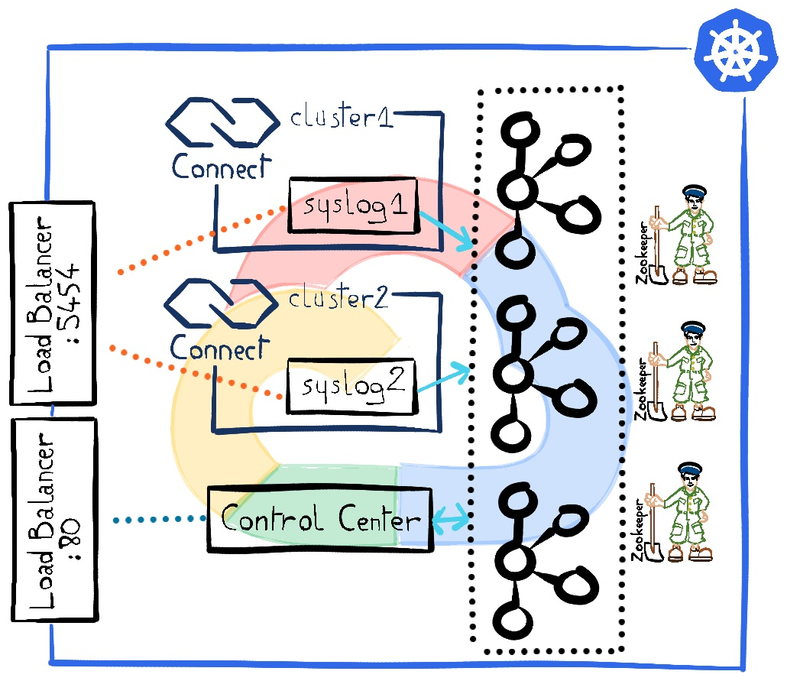
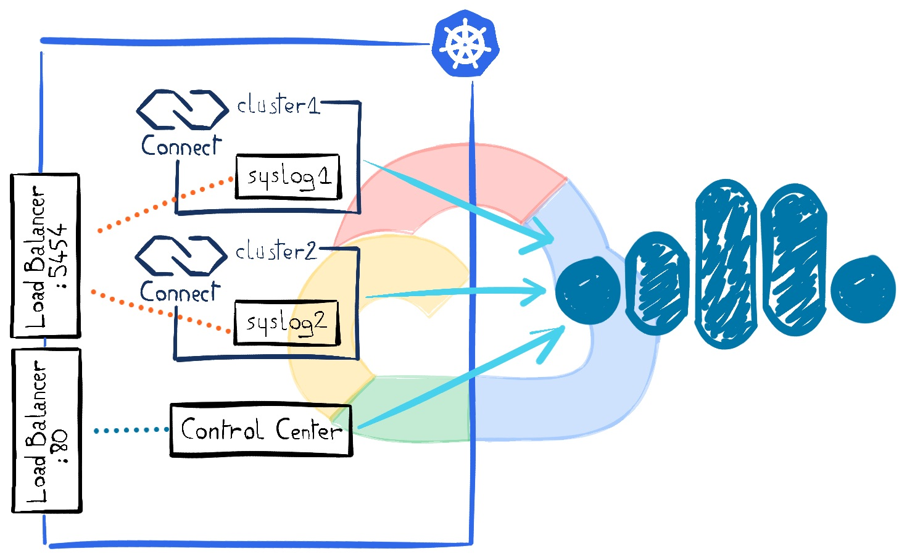
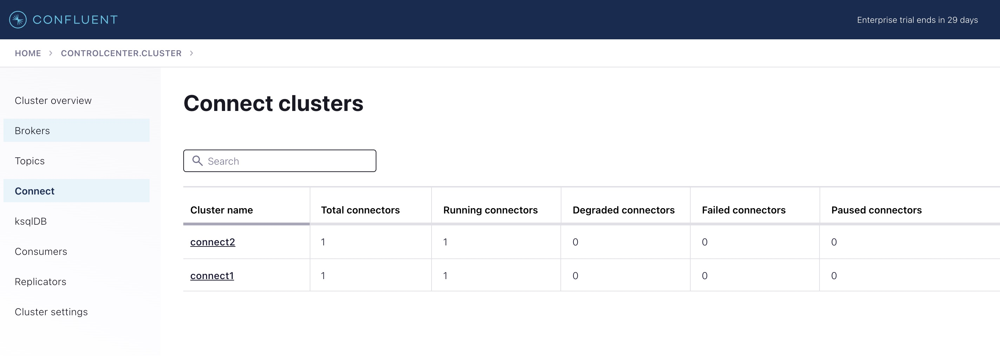
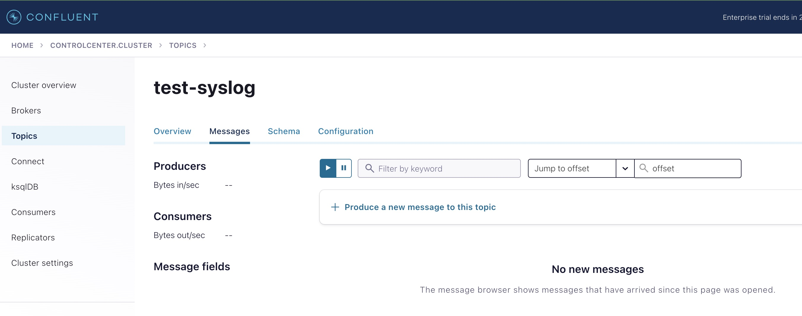
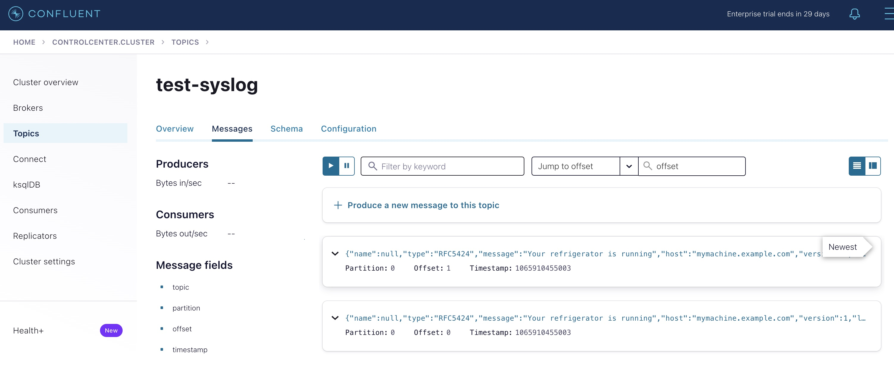

# Syslog source connector with HA

Usually connectors are hosted in a Kafka Connect cluster made up of at least 2 workers for high availability, if one fails, the connectors are rebalanced on the remaining one.

However this is not an expected behavior when using the [Syslog Source Connector](https://docs.confluent.io/kafka-connectors/syslog/current/overview.html) because it opens a listening port on which the syslog entries are sent. Therefore it has to stay on the same host whatever happens, because clients are configured to send the entries on a single host. 

Then comes the question about how to implement high availability if the connector can be hosted on a single defined worker... Here's a way to fulfill this requirement: instead of hosting the connector on a cluster of two Kafka Connect workers, let's create two single worker Kafka Connect clusters with a syslog connector in each one. Those two independent workers are behind a reverse proxy that is balancing the traffic across them. 

In order to showcase this scenario, this demo is built with Terraform, Kubernetes in GCP (GKE) and [Confluent for Kubernetes](https://docs.confluent.io/operator/current/overview.html). This demo is borken down in two flavours: one with a complete self managed Confluent Platform including brokers and the Zookeeper cluster and another one with only the Kafka Connect part backed by a Confluent Cloud Kafka cluster.

## Prerequisites

- A Docker daemon running
- Authenticate to the Google Cloud Platform from the CLI:
```bash
$ ./gcloud.sh auth login
Go to the following link in your browser:

    https://accounts.google.com/o/oauth2/auth?response_type=code&client_id=325940559.apps.googleusercontent.com&redirect_uri=https%3A%2F%2Fsdk.cloud.google.com%2Fauthcode.html&scope=openid+https%3A%2F%2Fwww.googleapis.com%2Fauth%2Fuserinfo.email+https%3A%2F%2Fwww.googleapis.com%2Fauth%2Fcloud-platform+https%3A%2F%2Fwww.googleapis.com%2Fauth%2Fappengine.admin+https%3A%2F%2Fwww.googleapis.com%2Fauth%2Fsqlservice.login+https%3A%2F%2Fwww.googleapis.com%2Fauth%2Fcompute+https%3A%2F%2Fwww.googleapis.com%2Fauth%2Faccounts.reauth&state=zDWzjjA0PlX7aQTKjHoBCWV2VEqqW&prompt=consent&access_type=offline&code_challenge=Zg1Dqg7D227YkAxzfbQeHRLbYDk0yQ_jx4XqjNspk&code_challenge_method=S26

Enter authorization code: 4/0AbUR2VNHWucVe2asSMhj2-fenLNgwD7j8Fb98eMzIn-srBqiiTN3oFFLZhluUHj2RpA

You are now logged in as [xxxx@confluent.io].
Your current project is [xxxxxxxxxxxxx].  You can change this setting by running:
  $ gcloud config set project PROJECT_ID 
```
- `kubectl` installed
- `jq`
- Create a file named `terraform.tfvars` in order to set some configuration that is tight to your environment:
```
region = "asia-south1"
owner = "<your name to tag the GCP resources>"
zone = "asia-south1-a"
gcp_project = "<your GCP project id>"
```

## Comprehensive  self managed cluster



The only thing you have to do is to run the `setup_no_cloud.sh` script. It's spinning up a 6 nodes Kubernetes cluster in GKE using Terraform, installs Confluent For Kubernetes and applies the cluster definition. Terraform is prompting you to confirm the resource creation, you need to enter `yes` (and not `y` otherwise it fails!):


```bash
$ ./setup_no_cloud.sh

Terraform used the selected providers to generate the following execution plan. Resource actions are indicated with the following
symbols:
  + create

Terraform will perform the following actions:

  # google_container_cluster.primary will be created
  + resource "google_container_cluster" "primary" {
[...]
Do you want to perform these actions?
  Terraform will perform the actions described above.
  Only 'yes' will be accepted to approve.

  Enter a value: yes
google_container_cluster.primary: Creating...
google_container_cluster.primary: Still creating... [10s elapsed]
[...]
google_container_cluster.primary: Still creating... [6m40s elapsed]
google_container_cluster.primary: Creation complete after 6m43s [id=projects/xxxxxxxxxxx/locations/asia-south1/clusters/syslog-lb]
[...]
Apply complete! Resources: 1 added, 0 changed, 0 destroyed.

Outputs:

kubernetes_cluster_host = "35.24.3.17"
kubernetes_cluster_location = "asia-south1"
kubernetes_cluster_name = "syslog-lb"
Fetching cluster endpoint and auth data.
kubeconfig entry generated for syslog-lb.
namespace/confluent created
Context "gke_xxxxxxxxxxxxxx_asia-south1_syslog-lb" modified.
"confluentinc" already exists with the same configuration, skipping
Release "operator" does not exist. Installing it now.
NAME: operator
LAST DEPLOYED: Thu Jun 15 10:17:52 2023
NAMESPACE: confluent
STATUS: deployed
REVISION: 1
TEST SUITE: None
NOTES:
The Confluent Operator

The Confluent Operator brings the component (Confluent Services) specific controllers for kubernetes by providing components specific Custom Resource
Definition (CRD) as well as managing other Confluent Platform services
zookeeper.platform.confluent.io/zookeeper created
kafka.platform.confluent.io/kafka created
connect.platform.confluent.io/connect1 created
connect.platform.confluent.io/connect2 created
service/syslog-service created
controlcenter.platform.confluent.io/controlcenter created
kafkatopic.platform.confluent.io/test-syslog created
connector.platform.confluent.io/syslog-connector1 created
connector.platform.confluent.io/syslog-connector2 created
$
```

In case you have your own Kubernetes cluster and you don't want to spin up a new one in the cloud, just run:

```bash
$ ./install_cfk.sh
namespace/confluent created
Context "gke_xxxxxxxxxxxxxx_asia-south1_syslog-lb" modified.
"confluentinc" already exists with the same configuration, skipping
Release "operator" does not exist. Installing it now.
NAME: operator
LAST DEPLOYED: Thu Jun 15 10:17:52 2023
NAMESPACE: confluent
STATUS: deployed
REVISION: 1
TEST SUITE: None
NOTES:
The Confluent Operator

The Confluent Operator brings the component (Confluent Services) specific controllers for kubernetes by providing components specific Custom Resource
Definition (CRD) as well as managing other Confluent Platform services
$ kubectl create secret generic control-center-user --from-file=basic.txt=creds-control-center-users.txt
$ kubectl apply -f cp-no-cloud.yml
zookeeper.platform.confluent.io/zookeeper created
kafka.platform.confluent.io/kafka created
connect.platform.confluent.io/connect1 created
connect.platform.confluent.io/connect2 created
service/syslog-service created
controlcenter.platform.confluent.io/controlcenter created
kafkatopic.platform.confluent.io/test-syslog created
connector.platform.confluent.io/syslog-connector1 created
connector.platform.confluent.io/syslog-connector2 created
$
```

## Hybrid architecture with Confluent Cloud 

The context is exactly the same as above, except that only the Kafka Connect cluster is self managed. The Kafka cluster is fully managed by Confluent Cloud. Control Center is not mandatory, but it gives a view on the Connect clusters and the connectors that are created.


In order to spin up this setup, just run `./setup_confluent_cloud.sh` and confirm the resource creation with `yes` when prompted: 

```
$  ./setup_confluent_cloud.sh

Terraform used the selected providers to generate the following execution plan. Resource actions are indicated with the following
symbols:
  + create
 <= read (data resources)
[...]

Terraform will perform the following actions:
Do you want to perform these actions?
  Terraform will perform the actions described above.
  Only 'yes' will be accepted to approve.

  Enter a value: yes

random_id.id: Creating...
random_id.id: Creation complete after 0s [id=iYivaA]
confluent_environment.syslog_demo: Creating...
google_container_cluster.primary: Creating...
confluent_environment.syslog_demo: Creation complete after 2s [id=env-m8ynvq]
confluent_kafka_cluster.syslog: Creating...
google_container_cluster.primary: Still creating... [10s elapsed]
confluent_kafka_cluster.syslog: Creation complete after 9s [id=lkc-v17380]
confluent_service_account.app-manager: Creating...

[...] 

Apply complete! Resources: 11 added, 0 changed, 0 destroyed.

Outputs:

kubernetes_cluster_host = "34.93.21.11"
kubernetes_cluster_location = "asia-south1"
kubernetes_cluster_name = "syslog-lb"
Fetching cluster endpoint and auth data.
kubeconfig entry generated for syslog-lb.
namespace/confluent created
Context "gke_xxxxxxxxxxxxxx_asia-south1_syslog-lb" modified.
"confluentinc" already exists with the same configuration, skipping
Release "operator" does not exist. Installing it now.
NAME: operator
LAST DEPLOYED: Thu Jun 15 16:14:31 2023
NAMESPACE: confluent
STATUS: deployed
REVISION: 1
TEST SUITE: None
NOTES:
The Confluent Operator

The Confluent Operator brings the component (Confluent Services) specific controllers for kubernetes by providing components specific Custom Resource
Definition (CRD) as well as managing other Confluent Platform services
secret/cloud-plain created
secret/control-center-user created
secret/kafka-client-config-secure created
connect.platform.confluent.io/connect1 created
connect.platform.confluent.io/connect2 created
service/syslog-service created
controlcenter.platform.confluent.io/controlcenter created
connector.platform.confluent.io/syslog-connector1 created
connector.platform.confluent.io/syslog-connector2 created
$
```


## Use it 

For convenience, this set up comes with Confluent Control Center which gives you an integration point with the self managed Kafka Connect cluster where you can see the state of the two clusters, if you're using a mac, you can just run the `open_c3.sh` script, it will open it in your browser, otherwise just get the public IP address from the load balancer and open it in a browser:

```bash
$  kubectl get services/controlcenter-bootstrap-lb
NAME                         TYPE           CLUSTER-IP      EXTERNAL-IP     PORT(S)        AGE
controlcenter-bootstrap-lb   LoadBalancer   10.91.243.122   34.10.19.88   80:31670/TCP   175m
```

To log in, use `admin`/`Developer1` credentials.



Then you can browse to the topics section and observe new messages from the `test-syslog` topic:



In order to generate new syslog entries, use the `send_syslog.sh` helper script, it will send two dummy entries:

```bash
$ ./send_syslog.sh
Connection to 35.200.144.255 port 5454 [tcp/apc-5454] succeeded!
Connection to 35.200.144.255 port 5454 [tcp/apc-5454] succeeded!
$ 
```



Then you can play and kill one Kafka Worker  at will and verify that the traffic is still flowing in the expected topic! 

## Tear down

Just run `./terraform.sh destroy`, answer `yes` to the prompt and it will dispose all provisioned resources, whether you were using Confluent Cloud or Confluent Platform only.

